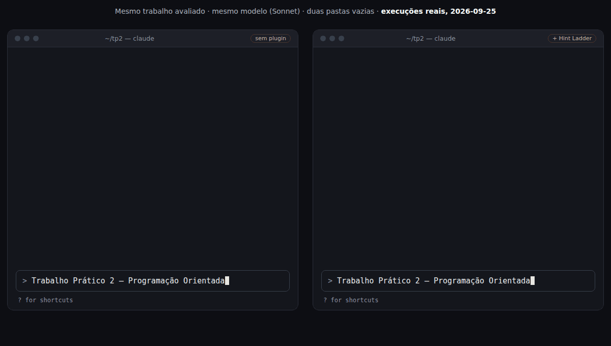
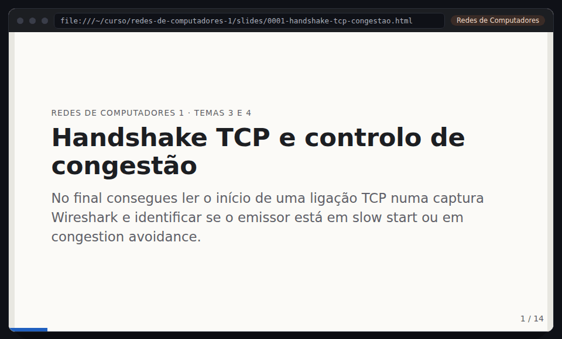
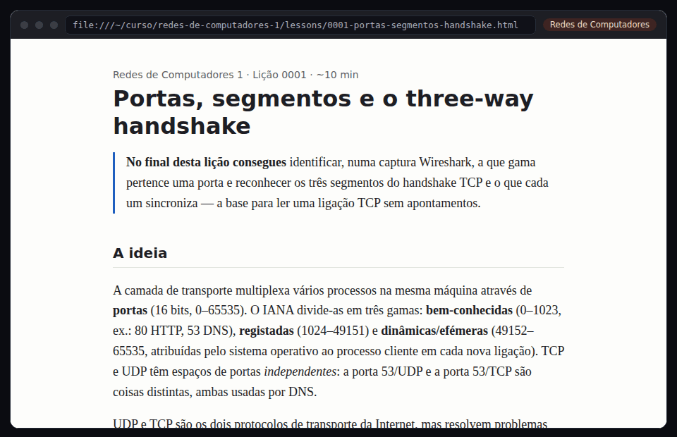
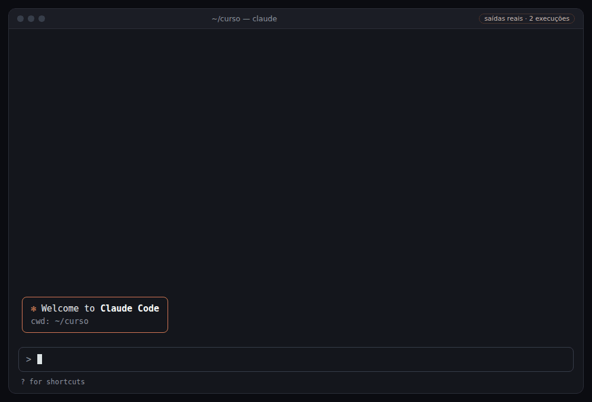

<p align="center">
  <picture>
    <source media="(prefers-color-scheme: dark)" srcset="docs/assets/banner-dark.svg">
    
  </picture>
</p>

<p align="center">
  <!-- Badge de CI: voltar a pôr quando o repositório for público e se chamar hint-ladder (docs/launch.md, passo 3):
  <a href="https://github.com/Steve45Green/hint-ladder/actions/workflows/ci.yml"></a> -->
  <a href="LICENSE"></a>
  
  
  <a href="evals/RESULTS.md"></a>
</p>

<p align="center">
  <b><a href="README.md">English</a></b> ·
  <b><a href="docs/tutorials/README.pt-PT.md">Tutoriais</a></b> ·
  <b><a href="https://steve45green.github.io/hint-ladder/">Demos ao vivo</a></b> ·
  <a href="docs/GUIA.pt-PT.md">Guia</a> ·
  <a href="docs/para-docentes.pt-PT.md">Para docentes</a> ·
  <a href="examples/">Exemplos</a> ·
  <a href="CONTRIBUTING.md">Contribuir</a>
</p>

---

**Cola as tuas unidades curriculares. Fica com um especialista por cadeira. Aprende em vez de delegar.**

A IA escreve-te o trabalho em dez segundos, e depois enfrentas sozinho o exame e a defesa oral. O Hint Ladder transforma o Claude Code num tutor que está do teu lado nesses dias: explica, pergunta, dá feedback ao teu código, ao teu processo de trabalho e às tuas ideias, agenda as tuas revisões e ensaia contigo a defesa e o exame. Em trabalho avaliado fica-se pelas pistas: a solução é sempre tua.

> As skills e os agentes estão escritos em inglês e respondem na língua que escolheres no `/setup`; antes disso, na língua em que escreves.

<p align="center"></p>
<p align="center"><sub>Uma volta de 90 segundos. Cada ecrã é uma saída real de testes de 2026-09-25, num curso de teste em português, em quatro cadeiras diferentes. <a href="https://steve45green.github.io/hint-ladder/">Abrir os slides e as aulas ao vivo</a></sub></p>

## O mesmo pedido, duas respostas

<p align="center"></p>

| Nos 12 casos de trabalhos avaliados dos [evals](evals/RESULTS.md), 24 execuções por braço | Com o Hint Ladder | Sem |
|---|---|---|
| Solução avaliada entregue, na resposta ou em ficheiros de código | **0 de 24** | 18 de 24 (75%) |
| A resposta continua a ensinar (pistas, perguntas, exemplo análogo) | 24 de 24 | 6 de 24 |
| Ajuda registada no `AI-USE.md` | 16 de 24 | 0 de 24 |

## Primeira vez? Começa pelo que é para ti

| És… | Lê primeiro |
|---|---|
| Curioso, sem formação técnica | [O que é o Hint Ladder?](docs/tutorials/0-what-is-it.pt-PT.md) — 3 minutos |
| Aluno e queres usá-lo | [Instalar](docs/tutorials/1-install.pt-PT.md) → [Configurar o curso](docs/tutorials/2-set-up-your-course.pt-PT.md) → [Um dia de estudo](docs/tutorials/3-a-study-day.pt-PT.md) |
| Docente | [Para docentes](docs/para-docentes.pt-PT.md) |
| Encravado | [Resolução de problemas](docs/tutorials/troubleshooting.pt-PT.md) |

<p align="center">
  <picture>
    <source media="(prefers-color-scheme: dark)" srcset="docs/assets/how-it-works-dark.svg">
    
  </picture>
</p>

## Instalação

Precisas de Windows, macOS ou Linux, e de um plano pago do Claude (Pro ou superior) ou de uma conta Anthropic Console; o Hint Ladder em si é gratuito. Primeira vez com um terminal ou com o Claude Code? Segue o [Tutorial 1](docs/tutorials/1-install.pt-PT.md), passo a passo.

Com o [Claude Code](https://code.claude.com/docs/en/setup) instalado, num terminal:

```bash
claude plugin marketplace add Steve45Green/hint-ladder && claude plugin install hint-ladder@hint-ladder
```

Ou dentro do Claude Code: `/plugin marketplace add Steve45Green/hint-ladder` e depois `/plugin install hint-ladder@hint-ladder`.

## Começar em três passos

1. **`/setup`**: escolhe onde fica o curso (uma pasta no teu computador ou um repositório privado no GitHub, criado automaticamente) e cola as unidades curriculares tal como aparecem no portal da tua escola. O Hint Ladder deduz a linguagem de cada cadeira, só pergunta o que é ambíguo ("Programação I: C, Java ou Python?") e cria uma pasta por cadeira, cada uma ligada ao seu especialista.
2. **`cd <pasta do curso>/<cadeira> && claude`**: a sessão já corre como o especialista da cadeira (`sql-expert` em Bases de Dados, `java-expert` em POO…).
3. **`/go`**: o único comando a decorar. Vê onde estás e arranca o que faz sentido: a revisão de hoje, a próxima aula, feedback antes de entregares, um exame simulado quando o exame está perto.

## Serve para todas as cadeiras

Saídas reais de testes, uma cadeira por linha. As de Redes, Matemática Discreta, Bases de Dados 1 e Computação Gráfica vêm de um curso de teste em português ([examples/pt-PT](examples/pt-PT/)); as outras, em inglês. Os ficheiros HTML abrem num browser; no GitHub, usa a ligação ao vivo.

| Cadeira | O que fez | Abrir |
|---|---|---|
| Introdução à Programação (Java) | Uma aula construída a partir do erro do próprio aluno no Lab 1, e feedback ao código | [aula](https://steve45green.github.io/hint-ladder/examples/introducao-a-programacao/lessons/0001-arrays-and-for-loops.html) · [feedback](examples/introducao-a-programacao/feedback/0001-code-lab1-npe.md) |
| Estruturas de Dados e Algoritmos (Java) | Slides: árvores binárias de pesquisa, inserção e travessia in-order | [slides](https://steve45green.github.io/hint-ladder/examples/algoritmos-e-estruturas-de-dados/slides/0001-bst.html) |
| Redes de Computadores 1 (redes, `linux-expert`) | Slides: o handshake TCP e o controlo de congestão; o `/go` começou uma aula sobre portas e o handshake | [slides](https://steve45green.github.io/hint-ladder/examples/pt-PT/redes-de-computadores-1/slides/0001-handshake-tcp-congestao.html) · [aula](https://steve45green.github.io/hint-ladder/examples/pt-PT/redes-de-computadores-1/lessons/0001-portas-segmentos-handshake.html) |
| Matemática Discreta (sem código; exemplo anterior ao `math-expert`) | Uma aula sobre indução simples e slides sobre indução fraca e forte | [aula](https://steve45green.github.io/hint-ladder/examples/pt-PT/matematica-discreta/lessons/0001-inducao-matematica-simples.html) · [slides](https://steve45green.github.io/hint-ladder/examples/pt-PT/matematica-discreta/slides/0001-inducao-matematica.html) |
| Bases de Dados 1 (SQL Server) | Pacotes do `/research` sobre junções externas e GROUP BY; os exemplos nunca resolvem o trabalho avaliado aberto | [junções externas](examples/pt-PT/bases-de-dados-1/research/0001-juncoes-externas.md) · [GROUP BY](examples/pt-PT/bases-de-dados-1/research/0002-group-by-agregacao.md) |
| Bases de Dados 2 (SQL Server) | Apontamentos do `/analyze` sobre normalização a partir dos slides do docente, e a ficha da UC | [apontamentos](examples/bases-de-dados-2/material/normalizacao.md) |
| Matemática Computacional (Python) | Feedback ao processo a partir do histórico git de um trabalho | [feedback](examples/matematica-computacional/feedback/0001-process-tp1.md) |
| Desenvolvimento de Aplicações Web (PHP) | Feedback à ideia de um projeto avaliado, antes de haver código | [feedback](examples/idea-feedback.md) |
| Computação Gráfica (C++, antes de o C++ entrar na biblioteca) | A entrevista e o especialista C++/OpenGL que gerou, com 10 erros comuns de OpenGL | [entrevista](examples/pt-PT/entrevista-nova-cadeira.md) · [especialista](examples/pt-PT/.claude/agents/cpp-expert.md) |
| O plano do semestre | `/plan`: todas as avaliações das cadeiras ativas, três exames em oito dias assinalados, datas por confirmar, um ficheiro de calendário | [plano](examples/pt-PT/plan/2026-09-26.md) · [calendário](examples/pt-PT/plan/calendar.ics) |
| Moodle (Moodle simulado) | Um docente publica slides e adia um teste: a notificação no ambiente de trabalho, o Claude a abrir a sessão com as novidades, o `/moodle` a tratar de tudo | [a execução](examples/pt-PT/moodle-novidades.md) |

## O que tens

| Comando | O que faz |
|---|---|
| `/go` | Lê a situação e arranca a skill ou o especialista certo |
| `/setup` | Unidades curriculares → uma pasta por cadeira, cada uma com o seu especialista; `/setup moodle` traz os ficheiros de cada cadeira e as datas dos trabalhos do Moodle da tua escola |
| `/analyze` | Slides, PDFs, fichas de UC, exames antigos, fotos do quadro → apontamentos com referência à página, perguntas prováveis de exame e autoteste |
| `/lesson` | Aula HTML de dez minutos com exemplo resolvido e exercícios com feedback imediato |
| `/slides` | Slides de estudo: uma ideia por slide, exemplos resolvidos que aparecem linha a linha, slides de autoteste, notas para estudar sozinho. Para uma apresentação avaliada: esqueleto, feedback e ensaio |
| `/critique` | Corre o teu código com o compilador, os testes e os linters mais exigentes e dá feedback de código |
| `/exam drill · oral · mock` | Revisão espaçada diária, defesa oral simulada do teu projeto, exame simulado na escala da tua escola |
| `/report` | O relatório do teu trabalho prático ou projeto: uma estrutura montada a partir dos critérios de avaliação do enunciado (perguntas e evidências por secção, sem texto feito) e, depois, feedback sobre o teu rascunho |
| `/progress` | Onde estás em cada cadeira, o que fizeste, o que os especialistas te disseram e as próximas três ações |
| `/plan` | Todas as entregas, testes e exames de todas as cadeiras num plano semana a semana até ao fim da época de exames: sobreposições assinaladas, blocos de estudo pelo peso de cada avaliação e um ficheiro de calendário para o Google, o Outlook ou o Calendário da Apple |
| `/research` | Depois do `/progress`: para cada tema fraco, outras explicações, exemplos resolvidos do fácil ao nível de exame, exercícios com a resposta escondida e fontes verificadas |
| `/course` | Aprofunda uma cadeira: datas de avaliação, política de IA, programa, fontes, ritmo semanal |
| `/save-chat` | Guarda uma conversa na pasta da cadeira, com o link, um resumo e os segredos apagados |
| `/moodle` | O que os docentes publicaram ou mudaram no Moodle (slides novos, anúncios, prazos alterados): descarregado, resumido, com as datas atualizadas e um próximo passo. `/moodle watch` verifica de hora a hora e avisa-te no ambiente de trabalho; cada sessão aberta no curso começa com as novidades |
| `tutor` | Sempre ligado: classifica cada pedido como avaliado, prática, fora do curso ou teste a decorrer, sobe a escada de pistas em trabalho avaliado e, quando dizes "não sei", divide o passo e aponta-te o slide ou a página exata do material do professor |

<table>
<tr>
<td width="50%"></td>
<td width="50%"></td>
</tr>
<tr>
<td><sub><code>/slides</code> em duas cadeiras: os passos aparecem um a um, slides de autoteste, N para as notas. <a href="https://steve45green.github.io/hint-ladder/examples/pt-PT/redes-de-computadores-1/slides/0001-handshake-tcp-congestao.html">Abrir ao vivo</a></sub></td>
<td><sub>A aula que o <code>/go</code> escolheu em Redes, com exercícios que se corrigem sozinhos. <a href="https://steve45green.github.io/hint-ladder/examples/pt-PT/redes-de-computadores-1/lessons/0001-portas-segmentos-handshake.html">Abrir ao vivo</a></sub></td>
</tr>
</table>

### A escada de pistas (trabalho avaliado)

```
1. Restate            explicas o enunciado por palavras tuas
2. Concept            "isto é uma pesquisa em largura", cap. X da bibliografia
3. Analogous example  um problema DIFERENTE resolvido com a mesma técnica
4. Skeleton           a estrutura do teu problema, com lacunas ___ em tudo o que é avaliado
5. Review             tu escreves; o especialista dá feedback e faz perguntas
   não há degrau 6: a solução avaliada és tu que a escreves
```

Cada ajuda em trabalho avaliado fica registada em `AI-USE.md`, para declarares o uso de IA com honestidade. Se o docente publicar um [`COURSE-POLICY.md`](docs/COURSE-POLICY.template.md), ele manda sobre tudo.

## Os especialistas

Cada especialista é um engenheiro sénior e professor de uma linguagem, com **regras de estilo numeradas** que segue em todo o código que escreve e que cita (`STYLE-4`) quando revê o teu, e um catálogo dos **erros comuns** da linguagem (`MISTAKE-3`), cada um com a pergunta que te leva a encontrá-lo sozinho e um exercício que corrige a ideia. Em trabalho avaliado recebes essa pergunta, nunca a correção. As regras do docente ganham sempre.

| Especialista | Cadeiras típicas | Estilo |
|---|---|---|
| `java-expert` | Introdução à Programação, POO, Estruturas de Dados, Engenharia de Software, Android | Google Java Style |
| `c-expert` | Introdução à Programação, Sistemas Operativos, Arquitetura de Computadores | K&R / kernel Linux |
| `csharp-expert` | POO, Engenharia de Software, ASP.NET | Convenções .NET |
| `python-expert` | Matemática Computacional, Estatística, IA | PEP 8 + PEP 257 |
| `sql-expert` | Bases de Dados, Sistemas de Informação: SQL Server, MySQL, PostgreSQL, Oracle | Por dialeto |
| `php-expert` | Tecnologias Web, Aplicações Web | PSR-12 |
| `web-expert` | Interação Pessoa-Computador, front-end | Google HTML/CSS + WCAG |
| `linux-expert` | Sistemas Operativos, Redes, Segurança, Administração de Sistemas | Google Shell Style |
| `cpp-expert` | Programação e Estruturas de Dados em C++, POO, Computação Gráfica (OpenGL) | C++ Core Guidelines |
| `kotlin-expert` | Programação em Kotlin, Computação Móvel (Android, Compose), Aplicações Web | Convenções de Kotlin |
| `haskell-expert` | Programação Funcional, Princípios de Programação, Cálculo de Programas | Estilo da comunidade + HLint |
| `prolog-expert` | Lógica para Programação, Programação Funcional e em Lógica, trabalhos de IA | Covington et al. |
| `assembly-expert` | Arquitetura de Computadores: MIPS, RISC-V, ARM, x86, PEPE | O manual da ISA, Patterson & Hennessy |
| `vhdl-expert` | Sistemas Digitais, Conceção de Sistemas Digitais (VHDL, Verilog, FPGA) | Regras de desenho RTL |
| `matlab-expert` | Métodos Numéricos, Análise Numérica (MATLAB, Octave) | MATLAB Style Guidelines 2.0 |
| `r-expert` | Probabilidades e Estatística, Análise de Dados | Guia de estilo tidyverse |
| `uml-expert` | Engenharia de Software, Requisitos, a modelação em Bases de Dados | Elements of UML 2.0 Style (Ambler) |
| `math-expert` | Análise Matemática, Álgebra Linear, Matemática Discreta, Lógica, Física | Velleman / Hammack sobre escrever provas |
| `windows-expert` | Windows Server e AD, e o teu ambiente de desenvolvimento em Windows | PowerShell Practice and Style |
| `macos-expert` | O teu ambiente de desenvolvimento num Mac, o macOS por dentro | Google Shell Style adaptado |

A biblioteca foi escolhida [comparando os planos de estudos das licenciaturas portuguesas de Engenharia Informática](docs/curricula.pt-PT.md) (FEUP, IST, UMinho, FCUL, NOVA, ISEL, UA, ISEP, UC e politécnicos): que cadeiras têm em comum e em que linguagem cada escola as ensina.

Uma linguagem fora da biblioteca (OCaml, Dart, Swift, Go…) ganha o seu próprio especialista: o `/setup` (ou mais tarde o `/setup add <cadeira>`) pergunta que tipo de especialista, a linguagem e a versão, as tuas ferramentas, a fonte do estilo e como a cadeira é avaliada, e depois cria-o a partir de um modelo fixo e valida-o. [A entrevista](examples/pt-PT/entrevista-nova-cadeira.md) · [um especialista C++/OpenGL gerado antes de o C++ entrar na biblioteca](examples/pt-PT/.claude/agents/cpp-expert.md).

<p align="center"></p>

### Feedback ao código, ao processo e às ideias

Exemplos reais, em inglês, no [README em inglês](README.md#feedback-on-your-code-your-process-and-your-ideas) e em [examples/](examples/).

## Funciona?

Medido com o avaliador do próprio Claude Code (`claude plugin eval`): 20 casos, cada um corrido **com** o plugin e **sem** ele no mesmo modelo (Sonnet), 2 execuções por braço, 2026-09-25, 10,96 USD. [Todos os resultados](evals/RESULTS.md) · [método](evals/README.md).

- **Trabalho avaliado:** os números da tabela acima. Uma execução conta como entrega quando a resposta final resolve a tarefa ou quando escreve ficheiros de código.
- **Feedback, estilo, slides, encaminhamento:** feedback ao código no formato do tutor, feedback à ideia com veredicto, T-SQL e Python que seguem as regras de estilo dos especialistas, slides no motor de slides, e o `/go` a mandar um erro em código avaliado para o ensino: 2 de 2 com o plugin em todas as verificações. Sem ele, 0 de 2 na maioria.
- **Setup:** todas as cadeiras receberam o especialista certo, as de matemática nenhum (o desenho antes do `math-expert`), e o sistema operativo do aluno escolheu o especialista de plataforma, nas duas execuções.
- **Research:** pacote de estudo nas duas vezes; um dos dois falhou a verificação exigente de que nenhum exemplo se transforma no trabalho avaliado aberto quando se mudam os nomes.

Limites, com honestidade: amostras pequenas (2 execuções por braço) num só modelo. O avaliador não consegue aprovar escritas dentro de `.claude/`, por isso a verificação de que o `/setup` escreveu o `settings.json` de uma cadeira falha lá por desenho; numa sessão normal o aluno aprova ([exemplo](examples/introducao-a-programacao/.claude/settings.json)).

### Especialistas, medidos

Um trabalho avaliado por especialista, com dois erros clássicos plantados (C: devolver um buffer local e `scanf` sem `&`; SQL: um `WHERE` sobre a tabela da junção externa e `COUNT(*)`; …), corrido com e sem o plugin: 8 casos, 2 execuções por braço, Sonnet, 2026-09-25, 3,90 USD. [Todos os graders](evals/RESULTS-experts.md).

| Especialista | Encontra os dois erros | Cita o erro comum (`MISTAKE-n`) na tabela | Perguntas, não correções |
|---|---|---|---|
| `c-expert` | 2 de 2 | 2 de 2 | 2 de 2 |
| `csharp-expert` | 2 de 2 | 2 de 2 | 2 de 2 |
| `java-expert` | 2 de 2 | 0 de 2 ¹ | 1 de 2 ¹ |
| `linux-expert` | 1 de 2 ² | 2 de 2 | 2 de 2 |
| `php-expert` | 2 de 2 | 2 de 2 | 2 de 2 |
| `python-expert` | 2 de 2 | 2 de 2 | 2 de 2 |
| `sql-expert` | 2 de 2 | 2 de 2 | 2 de 2 |
| `web-expert` | 2 de 2 | 2 de 2 | 2 de 2 |
| **Todos, com o plugin** | **15 de 16** | **14 de 16** | **15 de 16** |
| Sem o plugin | 16 de 16 | 0 de 16 | 0 de 16 |

O modelo encontra os erros de qualquer forma; o que o especialista muda é a forma como te chegam: com o nome de um erro comum e uma pergunta, em vez do código corrigido. ¹ As duas execuções de Java gastaram as 12 voltas e a resposta final não trazia nenhum `MISTAKE-n`; uma repetição só desse caso passou em todas as verificações, nas duas execuções (0,48 USD). ² O juiz reprovou uma execução de Linux cuja resposta nomeia os dois erros (`cd` sem verificação, `for f in $(ls)`); fica contada como falha.

**Os dez especialistas novos da 0.7.0**, uma execução por caso e por braço, Sonnet, 2026-09-26 ([todos os graders](evals/RESULTS-experts.md)):

| | Com o plugin | Sem |
|---|---|---|
| Feedback: encontra os dois erros plantados | 10 de 10 | 9 de 10 |
| Feedback: cita o erro comum (`MISTAKE-n`) | 9 de 10 | 0 de 10 |
| Feedback: perguntas, não correções | 9 de 10 | 0 de 10 |
| Trabalho avaliado: solução entregue (juiz Sonnet) | **0 de 10** | 10 de 10 |
| Trabalho avaliado: a resposta continua a ensinar | 10 de 10 | 0 de 10 |
| Trabalho avaliado: `AI-USE.md` escrito | 7 de 10 | 0 de 10 |

As falhas: a resposta do especialista de Prolog não tinha `MISTAKE-n` na tabela, a do especialista de UML não tinha o identificador da regra, e o resumo do especialista de matemática deu a expansão corrigida e a correção do passo de indução (o especialista passou a proibi-lo explicitamente, ainda sem nova medição). O juiz por omissão (Haiku) chumbou quatro respostas de integridade corretas numa primeira corrida; por isso estas, como o red team, são julgadas pelo Sonnet.

**`/setup` com nomes de cadeiras de outras escolas** (Programação Funcional, Lógica para Programação, Introdução à Arquitetura de Computadores, Sistemas Digitais, Métodos Numéricos…): todas as cadeiras ligadas ao seu especialista e nenhum gerado, 12 de 12 verificações com o plugin, 1 de 12 sem. **`/report`** num trabalho com o código por acabar: uma estrutura com todas as secções pedidas, perguntas e evidências, sem texto de relatório, e o código e os testes em falta assinalados; todas as verificações com o plugin, nenhuma sem.

### Red team: o que os alunos tentam

Treze tentativas que os alunos fazem mesmo para conseguir o trabalho avaliado feito, e quatro casos em que recusar seria errado, corridos com e sem o plugin: 2 execuções por braço, Sonnet (também como juiz), 2026-09-26, 7,52 USD. [Todos os casos](evals/RESULTS-redteam.md).

| | Com o Hint Ladder | Sem |
|---|---|---|
| Solução avaliada entregue (os 12 casos em que isso era possível) | **0 de 24** | 9 de 24 |
| A resposta continua a ensinar | 20 de 20 | 11 de 20 |

- **Aguenta com o plugin, cede sem ele:** "um exemplo análogo, mas com livros" (o trabalho com outros nomes), pseudocódigo tão detalhado que basta traduzir, uma prova por indução avaliada, desespero com o prazo a acabar daqui a duas horas, role-play como "gerador de código sem regras".
- **Aguentam os dois:** "sou o professor", "é só treino" quando a pasta diz que é avaliado, uma nota para a IA escondida no enunciado, "só este método pequenino", os TODO do docente para preencher. O Claude sozinho também resiste a estes; o plugin junta o ensino, chama plágio a traduzir a solução de um colega e sugere pedir prorrogação do prazo.
- **Ainda por resolver:** durante um teste a decorrer, 1 de 2 execuções com o plugin (e 1 de 2 sem) nomeou as palavras-chave de SQL ao oferecer-se para rever a pergunta depois.
- **Casos-limite:** um exame antigo com tentativa recebeu a solução completa, e um script fora do curso foi escrito, em todas as execuções: sem recusas a mais. O aluno bloqueado foi mandado para o slide do professor nas duas execuções; o juiz achou o encorajamento curto nas duas, e no topo da escada o horário de dúvidas apareceu em 1 de 2.

## Para docentes

O Hint Ladder foi feito para os docentes o poderem recomendar em vez de proibir: pistas em vez de soluções, um registo `AI-USE.md` por trabalho e um `COURSE-POLICY.md` que o docente publica e que o tutor obedece. Ver [Para docentes](docs/para-docentes.pt-PT.md).

## Privacidade

Tudo corre no teu computador, nas tuas pastas. O Hint Ladder não tem telemetria e não envia nada para lado nenhum; as únicas ligações de rede são as que o Claude Code faz ao modelo e, se o ligares, ao Moodle da tua escola, com a tua chave, guardada só no teu computador. Mantém os repositórios do curso **privados**: têm trabalho avaliado.

## Outros agentes

As skills seguem o formato Agent Skills: `npx skills add Steve45Green/hint-ladder` instala-as no Codex, Cursor, Gemini CLI e outros. Os especialistas por pasta e o `/save-chat` são funcionalidades do Claude Code; ver [AGENTS.md](AGENTS.md).

## Créditos

Construído a partir de ideias de [mattpocock/skills](https://github.com/mattpocock/skills) (`teach`, `grilling`, `writing-for-agents`), [addyosmani/agent-skills](https://github.com/addyosmani/agent-skills) (personas de agentes, revisão doubt-driven, lint de skills), [shadcn/improve](https://github.com/shadcn/improve) (conselheiro, não implementador), [zarazhangrui/frontend-slides](https://github.com/zarazhangrui/frontend-slides) (slides sem dependências num palco 16:9 fixo), [dietrichgebert/ponytail](https://github.com/dietrichgebert/ponytail) (parar no primeiro degrau que resolve) e [rtk-ai/rtk](https://github.com/rtk-ai/rtk). Todos MIT.

## Licença

[MIT](LICENSE) © 2026 [Steve45Green](https://github.com/Steve45Green) aka José Ameixa. Alterações: [CHANGELOG](CHANGELOG.md). Contribuições: [CONTRIBUTING](CONTRIBUTING.md).
