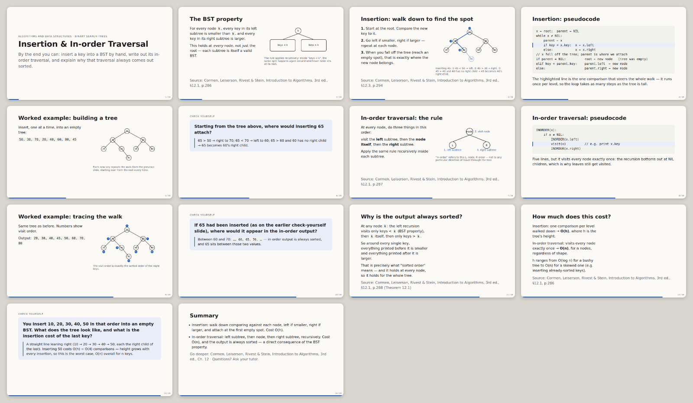

# 3. A study day

*[Português](3-a-study-day.pt-PT.md) · [All tutorials](README.md)*

**Time:** 15 to 30 minutes. **You need:** a unit folder from [Tutorial 2](2-set-up-your-course.md).

## The only command to remember

```bash
cd <course>/<unit>
claude
```

```
/go
```

`/go` reads where you are (reviews due, the next test, new files from class) and starts one thing. What it usually picks, and what you can also ask for directly:

| Situation | `/go` starts | Or type |
|---|---|---|
| Reviews due today | spaced-repetition review: questions from what you learned before, answered from memory | `/exam drill` |
| New PDF or slides from class in the folder | notes with page references and self-test questions | `/analyze <file>` |
| A topic you haven't studied | a ten-minute lesson in the browser, with exercises that correct themselves | `/lesson <topic>` |
| You want to revise a topic | a slide deck that reveals one step at a time, with check-yourself slides | `/slides <topic>` |
| A test within 14 days | a mock exam graded on your scale | `/exam mock` |

## A typical 20 minutes

1. `/go` → **5 min of reviews**: it asks, you answer without looking, it moves each card up or down (1, 3, 7, 14, 30 days).
2. **10 min of new material**: a `/lesson`, or `/slides` on the topic from today's class.
3. **5 min**: one question to check you remember what you just saw. Answer it without scrolling up: that is what makes it stick.

## Slides for revision

```
/slides binary search trees
```

It writes `slides/0001-….html` and tells you how to open it (double-click the file, or it opens it for you). In the browser: → or space to advance, N for the explanation of each slide, F for full screen. To print or read on paper: print to PDF, landscape, no margins, one slide per page.

A real one: [examples/…/slides/0001-bst.html](../../examples/algoritmos-e-estruturas-de-dados/slides/0001-bst.html) (download it and open it in a browser).



## Where everything is saved

In the unit's folder: `lessons/`, `slides/`, `records/` (your review cards), `material/` (notes from PDFs), `feedback/`. Nothing is lost when you close Claude Code, and next time `/go` continues from there.

## Tips

- Ask anything in your own words; you don't need a command. "I don't understand pointers to pointers" works.
- Long conversation getting slow or confused? `/compact` summarises it and carries on.
- Want to keep an important conversation? `/save-chat`.

Next: [4. Graded work](4-graded-work.md).
